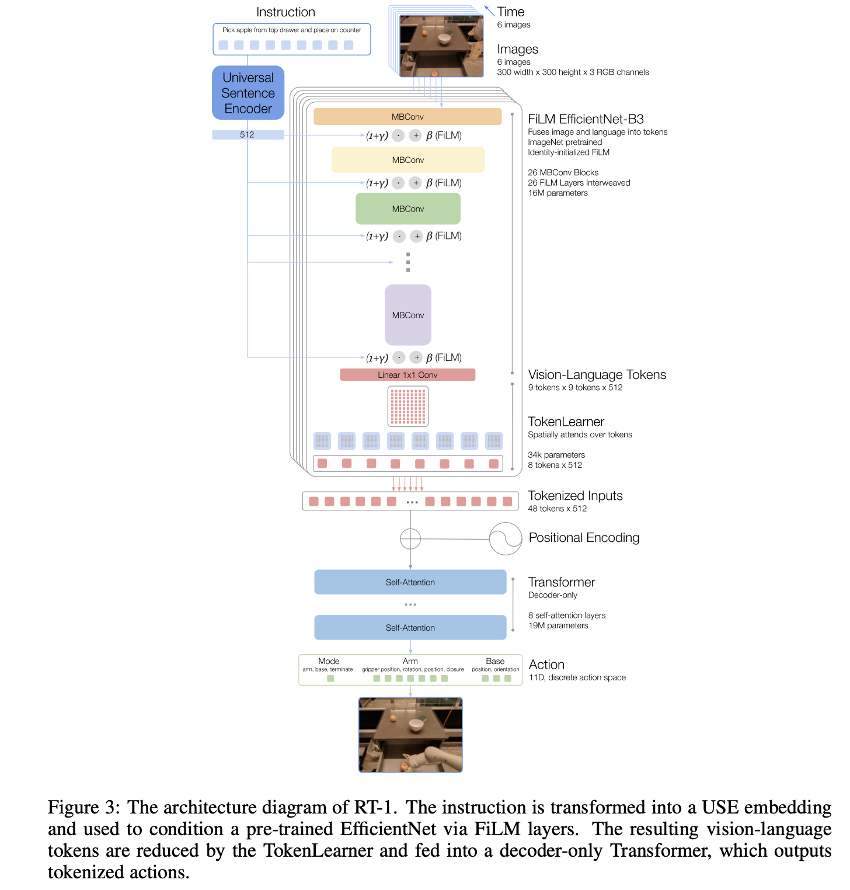

## Architecture

# Modules

### RT (`modules/rt.py`)
The main orchestrator that wires all components together. It processes video frames conditioned on language instructions through vision encoding, token compression, transformer processing, and action prediction.

**Why needed:** Provides a clean interface to the full VLA pipeline - you only need to call `model(frames, instructions)`.

### SentenceEncoder (`modules/sentenceEncoder.py`)
Converts natural language instructions into fixed-size embeddings using a pretrained SentenceTransformer (all-MiniLM-L6-v2).

**Why needed:** The model needs a numerical representation of language to condition visual processing. The pretrained encoder provides rich semantic embeddings without training from scratch.

### EfficientNetFiLM (`modules/efficientNetFiLM.py`)
A vision encoder based on EfficientNet-B3 where each convolutional block is modulated by FiLM layers conditioned on language.

**Why needed:** Standard vision encoders ignore language. By injecting language information at every layer via FiLM, the visual features become language-aware from early processing stages.

### FiLM (`modules/FiLM.py`)
Feature-wise Linear Modulation - generates scale (gamma) and shift (beta) parameters from language embeddings to transform visual features: `(1 + gamma) * features + beta`.

**Why needed:** FiLM allows language to modulate what visual features the network emphasizes. For "pick up the red apple", it can amplify red-colored regions in feature maps.

### TokenLearner (`modules/tokenLearner.py`)
Compresses spatial feature maps (H x W) into a fixed number of tokens (8) using learned attention maps.

**Why needed:** Transformers have quadratic complexity in sequence length. Converting high-resolution feature maps to 8 tokens makes the transformer tractable while preserving important information.

### PositionalEncoding (`modules/positionalEncoding.py`)
Adds sinusoidal position information to token sequences so the transformer knows the temporal order of frames.

**Why needed:** Transformers are permutation-invariant by default. Positional encoding lets the model distinguish between frame 1 and frame 6, enabling temporal reasoning.

### MultiHeadAttention (`modules/multiHeadAttention.py`)
Standard scaled dot-product attention split across multiple heads, allowing tokens to attend to each other.

**Why needed:** Attention enables tokens from different frames to exchange information - a token from frame 3 can attend to relevant tokens from frame 1 to understand scene dynamics.

### TransformerDecoder (`modules/transformerDecoder.py`)
A transformer block with multi-head attention, feed-forward network, residual connections, and layer normalization.

**Why needed:** Stacking 8 of these blocks gives the model capacity to learn complex temporal patterns and action-relevant features from the token sequence.

### ActionHead (`modules/actionHead.py`)
Takes the last token from each frame and projects it to action predictions (11 action types, 256-dim each).

**Why needed:** Converts transformer representations into the actual robot action space. The 11 actions cover typical robot degrees of freedom (gripper, arm joints, base movement, etc.).
